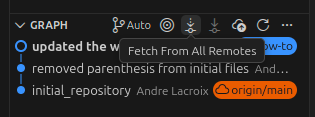

# How do I start developing after setting up my development environment?
## 1. Ensure that the latest branches on git have been downloaded by clicking the "Fetch from All Remotes" button in the Source Control tab (looks like an Ethernet Icon) \


## 2. Run the following commands
```
rojo serve
lune run liveSyncback.luau BossFight.rbxl
```
Alternatively, only run the lune command and press the rojo serve icon in the lower right of your screen if available. If it is unavailable, press Ctrl+Shift+P, select Rojo: Open Menu, then sync default.project.json \
⚠️ NOT syncback.project.json ⚠️

## 3. Connect to rojo from Roblox Studio
Open the Rojo plugin from within Roblox Studio, then click Connect.


# Anything to know when pushing my changes to Github?
Ensure you are not on the main branch by clicking the branch on the bottom left. If you are still on main, then select to create a new branch.